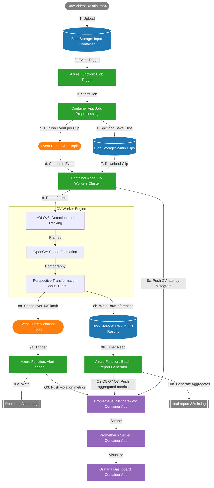

# Συνολική Διαδικασία (Markdown Overall Process)

## 1. Ingestion & Preprocessing Layer

**Upload:** Το raw video της κυκλοφορίας (διάρκειας 32 λεπτών, 25fps) αναρτάται στο Azure Blob Storage (Input Container).

**Trigger:** Η ολοκλήρωση του upload ενεργοποιεί αυτόματα μια Azure Function (Blob Trigger).

**Orchestration:** Η Function δεν κάνει επεξεργασία η ίδια· καλεί το API του Azure Container Apps για να εκκινήσει ένα Preprocessing Container Job.

**Segmentation:** Το Preprocessing Job κατεβάζει το βίντεο, χρησιμοποιεί FFmpeg και το τεμαχίζει σε ανεξάρτητα, μικρότερα κλιπ των 2 λεπτών.

**State & Notification:** Τα 2-min clips αποθηκεύονται σε ξεχωριστό container στο Blob Storage. Για κάθε έτοιμο κλιπ, το Job δημοσιεύει (Publish) ένα event στο κεντρικό Azure Event Hubs (Kafka-compatible) με το URI του αρχείου.

## 2. Stream Processing & Computer Vision Layer

**Horizontal Scaling:** Το Azure Container Apps (CV Workers Cluster) παρακολουθεί το Event Hub και κλιμακώνει οριζόντια τα instances (έως 16 ταυτόχρονα, ένα για κάθε clip).

**Core Inference:** Κάθε Worker καταναλώνει το αντίστοιχο μήνυμα, κατεβάζει το clip και εκτελεί:

- **YOLOv8:** Για ανίχνευση (detection), ταξινόμηση (ΙΧ vs Φορτηγά) και απόδοση μοναδικού Tracking ID σε κάθε όχημα.
- **OpenCV:** Για τον υπολογισμό της ταχύτητας.
- **Perspective Transformation (Bonus +10%):** Αντί για την απλοϊκή γραμμική προσέγγιση των 17 μέτρων, ο κώδικας εφαρμόζει μετασχηματισμό προοπτικής (homography matrix) με βάση το πραγματικό μήκος των 25m των πράσινων γραμμών για εξάλειψη του σφάλματος βάθους.

## 3. Split Flow: Real-Time Alerts vs. Analytics Storage

Μετά την επεξεργασία των frames, η ροή διακλαδίζεται αυστηρά σε δύο υπο-ροές:

### Α. Ροή Πραγματικού Χρόνου (Real-Time Alerts Line)

**Condition:** Εάν η υπολογισμένη ταχύτητα ενός οχήματος (βάσει του Tracking ID του) ξεπεράσει τα $130\text{ km/h}$.

**Ingestion:** Ο Worker παράγει ένα event με το schema του οχήματος και το κάνει publish σε ένα ξεχωριστό Topic στο Azure Event Hubs (π.χ. speed-violations).

**Execution:** Μια αποκλειστική Azure Function (Event Hub Trigger) καταναλώνει άμεσα το event και τυπώνει τα στοιχεία του συγκεκριμένου οχήματος (ID, ταχύτητα, λωρίδα) στο log stream της, εξασφαλίζοντας real-time απομονωμένο reporting ανά παράβαση.

### Β. Ροή Ανάλυσης & Αναφορών (Batch/Reporting Line)

**Raw Output:** Οι Workers γράφουν τα analytical αποτελέσματα (ID, vehicle type, speed, timestamp, lane, direction) σε αρχεία JSON στο Blob Storage (Analytics Storage).

**Consolidation (The Cron Approach):** Μια Azure Function (Timer Trigger) εκτελείται προγραμματισμένα (π.χ. μία φορά στο τέλος του computation).

**Aggregation:** Η συνάρτηση διαβάζει το σύνολο των JSON αρχείων και για τα 32 λεπτά του βίντεο, εκτελεί stateful aggregation και παράγει το τελικό Log File / Report, το οποίο περιλαμβάνει:

- Συνολικό αριθμό οχημάτων ανά ρεύμα.
- Συνολικό αριθμό παραβατών (>$90\text{ km/h}$ για ΙΧ, >$80\text{ km/h}$ για φορτηγά).
- Αριθμό οχημάτων ανά ρεύμα και ανά 5λεπτο.
- Μέση ταχύτητα ανά ρεύμα και ανά 5λεπτο (π.χ. inbound, 1st 5min, 60kmh).

## 4. Business Metrics Layer (Prometheus / Grafana)

**Architecture:** Τα Prometheus & Grafana εκτελούνται ως Container Apps στο ήδη υπάρχον Azure Container Apps Environment (`vana-traffic-env`), αξιοποιώντας την ίδια υποδομή με τους CV Workers.

**Metrics Collection:** Καθώς οι CV Workers είναι εφήμεροι (ephemeral), κάνουν push business metrics στον Prometheus Pushgateway (επίσης Container App) αμέσως μετά την επεξεργασία κάθε clip. Τα metrics που παράγονται αφορούν αποκλειστικά τα ερωτήματα της εργασίας:

- **Q2:** Ποσοστό φορτηγών ανά λωρίδα (`truck_ratio_per_lane`)
- **Q3:** Αριθμός παραβατών ανά τύπο οχήματος (`speeders_total`)
- **Q5:** Αριθμός οχημάτων ανά λωρίδα και ανά 5λεπτο (`vehicle_count_per_lane`)
- **Q7:** Μέση ταχύτητα ανά λωρίδα και ανά 5λεπτο (`avg_speed_per_lane`)
- **Q8:** Φορτηγά εκτός τέρμα αριστερής λωρίδας (`trucks_not_far_left_total`)
- **Latency:** Χρόνος επεξεργασίας κάθε clip σε histogram (`clip_processing_duration_seconds`)

**Visualization:** Ο Prometheus κάνει scrape τον Pushgateway και το Grafana απεικονίζει τα παραπάνω business metrics σε πραγματικό χρόνο κατά τη διάρκεια της επεξεργασίας.

